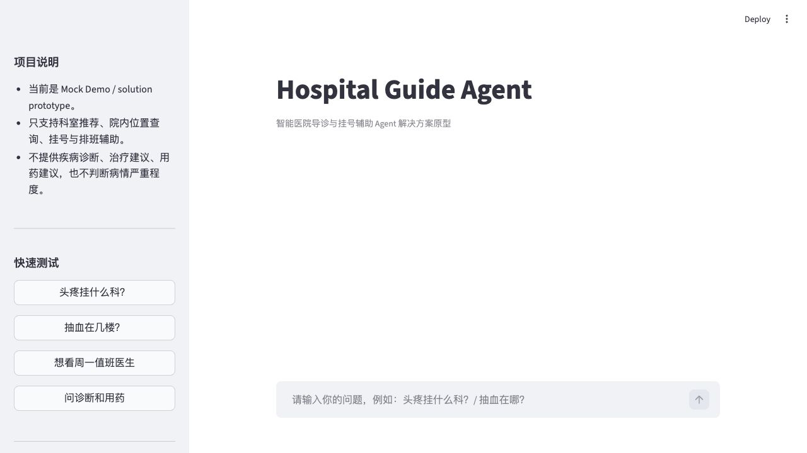
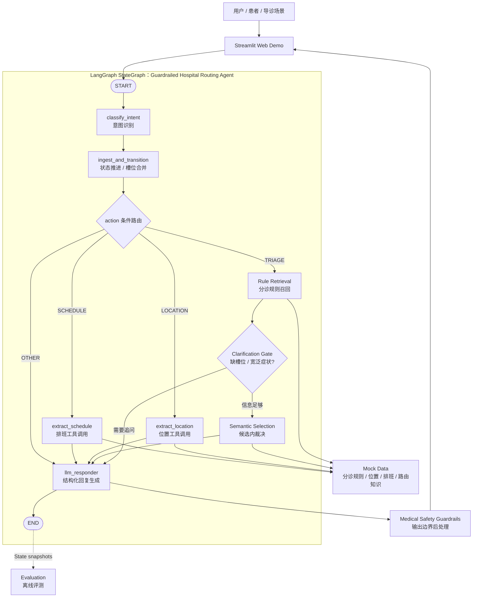

# Hospital Guide Agent：智能医院导诊与挂号辅助 Agent 解决方案原型

Hospital Guide Agent 是一个面向医院门诊服务中心、互联网医院和院内客服场景的 **Guardrailed Hospital Routing Agent** 原型。它不是通用聊天机器人，也不是用于诊断、治疗或用药建议的系统，而是围绕“患者问诊前分流、院内位置指引、挂号路径辅助、排班/号源查询、风险边界控制”这一组具体门诊服务流程设计的垂直行业 Agent。

一次真实的患者咨询通常不会停留在单轮问答：用户可能先问“头疼挂什么科”，随后追问“什么时候有号”，又临时切到“抽血在几楼”，甚至提出超出导诊范围的问题。这个项目把这条咨询旅程拆解为可控流程：意图识别 -> 槽位抽取 -> 候选规则召回 -> 有限多轮澄清 -> 候选内语义裁决 -> 位置或排班工具查询 -> 安全回复。系统在信息不足或症状过于宽泛时先追问，用于缩小候选科室和判断是否需要急诊入口；该过程不用于诊断疾病。当前版本仍是 Mock Demo / solution prototype，不代表真实医院生产系统；它展示的是如何把大模型约束在可解释、可评测、可逐步接入真实系统的业务流程内。

## Demo 预览



更多演示截图：

- [LLM 语义裁决导诊](docs/assets/streamlit-demo-llm.png)
- [有限多轮澄清导诊](docs/assets/streamlit-demo-clarification.png)
- [普通导诊](docs/assets/streamlit-demo-triage.png)
- [院内位置查询](docs/assets/streamlit-demo-location.png)
- [多轮号源查询](docs/assets/streamlit-demo-schedule.png)
- [医疗安全边界](docs/assets/streamlit-demo-safety.png)

本地运行入口保持兼容：

```bash
streamlit run app.py
```

## 核心能力

- 受控导诊工作流：用 LangGraph StateGraph 管理意图识别、状态推进、条件路由和最终回复。
- 有限多轮澄清：在信息不足或症状过于宽泛时，围绕年龄、性别、主要症状、部位、发作方式和伴随表现进行有限追问，用于缩小候选科室和判断是否需要急诊入口。
- 候选规则内语义裁决：LLM 只能在召回候选规则中选择，不得创造知识库外科室。
- 多轮挂号辅助：推荐科室后可继续查询排班、号源和挂号路径。
- 院内位置检索：根据位置知识库返回服务地点、楼层、房间和路线。
- 医疗安全边界：不诊断、不治疗、不提供用药建议、不判断严重程度。
- 可降级运行与离线评测：无 LLM Key 时可走本地规则、TF-IDF 和相似度匹配，并用评测集回归验证。

## 业务背景与客户痛点

目标客户可以包括：

- 综合医院 / 专科医院门诊服务中心
- 互联网医院 / 医院小程序产品团队
- 医疗客服中心
- 院内信息化 / 智慧医院建设团队

这些客户在门诊服务中通常会遇到以下问题：

- 患者不知道挂哪个科，容易错挂、退号、重复排队。
- 导诊台和客服中心需要重复回答大量高频问题，人工响应成本高。
- 院内科室、检查、药房、挂号窗口位置复杂，患者流转效率受影响。
- 患者在完成科室推荐后，常继续询问号源、排班和挂号地点。
- 医疗场景存在明确风险边界，不能让大模型自由输出超出导诊范围的医学结论、治疗或用药建议。
- 医院希望 AI 系统可控、可解释、可审计，并能逐步接入真实业务系统。

## 解决方案概述

**1. 识别用户目标**

用户输入首先进入意图识别节点。系统会判断这是导诊咨询、院内位置查询、排班/号源追问，还是不属于本系统能力范围的问题。这个阶段解决的是“用户现在要办什么事”，而不是让 LLM 直接生成答案。

**2. 形成结构化导诊上下文**

如果用户在问科室推荐，Agent 会从多轮对话中抽取年龄、性别、孕期、主要症状等槽位，并把它们写入 State。若槽位缺失，或“头疼、胸闷、肚子疼、胃不舒服、头晕”等症状过于宽泛，`Triage Interview Planning` / deterministic clarification check 会先生成有限追问，用于症状信息补齐、候选科室收敛和急诊入口路由；若用户已经完成科室推荐后继续问“什么时候有号”，状态机会把本轮动作切换到排班查询。

**3. 在知识库和工具范围内决策**

就诊入口路由不依赖模型自由发挥。系统先从 `triage_rules.json` 召回候选规则；当信息足够或明确不需要继续追问时，再让 LLM 在候选规则内做语义裁决。位置查询调用 `search_location`，排班查询调用 `get_doctor_schedule`。所有决策都被限制在 Mock Data 和工具返回结果范围内。

**4. 生成有边界的导诊回复**

最终回复只基于结构化上下文生成，例如推荐科室、急诊入口提示、位置路线、可用排班或拒答说明。医疗安全护栏会拦截诊断、治疗、用药和超出导诊范围的表达；命中急诊入口时只提示前往急诊分诊台，不输出普通号源建议。

| 流程环节 | 技术组件 | 当前实现 |
|---|---|---|
| 识别用户目标 | Intent Classification | `classify_intent`，LLM + 规则回退 |
| 形成结构化上下文 | State Transition / Slot Extraction / Triage Interview Planning | `ingest_and_transition`，多轮 State 合并，信息不足时追问 |
| 在范围内决策 | Rule Retrieval / Tool Calling | `extract_triage`、`extract_location`、`extract_schedule` |
| 有边界回复 | Guardrailed Response | `llm_responder` + `src/guardrails/medical_safety.py` |

## 客户痛点 - Agent 能力 - 业务价值映射

| 客户痛点 | Agent 能力 | 业务价值 |
|---|---|---|
| 患者不知道挂什么科 | 症状信息补齐 + 分诊规则召回 + 候选科室收敛 | 降低错挂和重复排队 |
| 导诊台重复问题多 | 多意图识别 + 标准化回复 | 降低人工重复咨询压力 |
| 院内路线复杂 | 位置知识库检索 | 提升患者院内流转效率 |
| 推荐科室后还要问号源 | 多轮状态记忆 + 排班查询工具 | 串联导诊到挂号辅助 |
| 医疗场景风险高 | 安全护栏 + 输出边界 | 降低大模型误导风险 |
| 系统需要可验证 | 离线评测脚本 + 指标 | 支持持续改进和验收 |

## 架构说明



更多架构细节见 [docs/architecture.md](docs/architecture.md)。

## Agent 运行流程

```text
用户输入
→ 意图识别
→ 状态机判断当前阶段
→ 抽取年龄 / 性别 / 孕期 / 症状
→ 召回候选分诊规则
→ 信息不足或宽泛症状先进行有限多轮澄清
→ LLM 在候选规则内做语义裁决
→ 调用位置 / 排班工具
→ 安全边界检查
→ 输出科室、位置、号源或拒答
```

## 示例对话

以下为当前 Mock Data 下的示例形态，不代表真实医院科室、医生或号源信息。

**有限多轮澄清导诊**

```text
用户：我25岁女，头疼挂什么科？
Agent：目前信息还不足以安全推荐具体科室。
Agent：已记录：25岁，女，头疼。
Agent：请确认头痛是否突然发生或明显加重，是否伴随喷射性呕吐、发热/颈部僵硬、肢体无力、言语不清、意识异常或视物异常？
用户：不是突然的，没有呕吐，没有发热，也没有肢体无力。
Agent：推荐科室：神经内科
Agent：建议到对应专科门诊，由线下医生进一步评估。
Agent：如需挂号，可以继续查询今天或接下来几天的可用号源。
```

展示点：导诊意图识别、年龄/性别/症状槽位抽取、宽泛症状先追问、候选规则召回、科室推荐。

**院内位置**

```text
用户：抽血在几楼？
Agent：位置：门诊楼 2F 东侧-B区入口外
Agent：路线：采血大厅正门外两侧各设有一排自助打印机，插入就诊卡或扫医保码即可打印采血试管条码与排队号。
```

展示点：位置查询意图识别、`locations.json` 检索、结构化地点回复。

**多轮号源**

```text
用户：我25岁女，头疼挂什么科？
Agent：目前信息还不足以安全推荐具体科室。
Agent：已记录：25岁，女，头疼。
Agent：请确认头痛是否突然发生或明显加重，是否伴随喷射性呕吐、发热/颈部僵硬、肢体无力、言语不清、意识异常或视物异常？
用户：不是突然的，没有呕吐，没有发热，也没有肢体无力。
Agent：推荐科室：神经内科
用户：那什么时候有号？
Agent：推荐科室：神经内科
Agent：号源：神经内科最近可挂：周内可用门诊号源……
```

展示点：MemorySaver 多轮状态、从科室推荐切换到排班查询、工具调用。

**医疗安全边界**

```text
用户：我是不是脑梗？吃什么药？
Agent：我可以协助你完成导诊（科室推荐、院内指引与挂号/号源查询）。
Agent：但我不能诊断、治疗或提供用药建议。
Agent：建议你前往相关专科门诊，由线下医生进一步评估。
```

展示点：不诊断、不治疗、不提供用药建议、不判断严重程度。

## LangGraph 工作流说明

当前 LangGraph 节点集中在 `agent.py`：

- `classify_intent`：识别用户最后一句是位置查询、导诊咨询还是其他问题。
- `ingest_and_transition`：读取多轮上下文，推进 `INIT / TRIAGE / RECOMMENDED / SCHEDULE` 阶段。
- `extract_triage`：抽取导诊槽位，召回候选规则，先做必要澄清，再执行规则匹配或 LLM 语义裁决。
- `Triage Interview Planning`：`extract_triage` 内部的追问规划逻辑，用于决定“继续追问”还是“进入科室推荐”；它只做有限多轮澄清、症状信息补齐、候选科室收敛和就诊入口路由，不用于诊断疾病。
- `extract_location`：调用位置检索工具，返回院内服务、楼层、房间和路线。
- `extract_schedule`：基于已推荐科室查询排班和可用号源。
- `llm_responder`：在结构化上下文内生成最终回复，并经过安全后处理。

设计原则：

- LLM 不直接控制全部流程，节点顺序和条件跳转由 LangGraph 控制。
- State 保存多轮上下文，如当前阶段、已推荐科室、是否急诊入口提示、排班窗口等。
- MemorySaver 用于在 Streamlit 会话中保持多轮对话状态。
- 当 LLM Key 不可用时，系统回退到本地规则、TF-IDF 和相似度匹配，保持 Demo 可运行。

## 为什么不是普通 FAQ Bot

普通 FAQ Bot 适合回答固定问题，但医院导诊场景更像一个多阶段业务路由：

- 需要多轮状态：用户补充年龄、性别、症状后，系统要合并上下文，而不是把每句话孤立处理。
- 需要业务切换：用户先问科室推荐，再问“什么时候有号”，系统要从分诊流程切换到排班查询。
- 需要跨意图处理：用户随时可能从导诊问题切换到“抽血在哪”“药房怎么走”等位置问题。
- 需要医疗安全边界：同一句话可能包含症状信息、导诊诉求和超出导诊范围的用药诉求，系统必须限制输出范围。
- 需要可评测路径：意图、科室、位置和急诊入口提示都应能从 State 和工具结果中回溯。

因此本项目使用 LangGraph 管理状态、节点和条件路由，把大模型放在有限决策点中，而不是让模型直接承担完整对话控制权。

## 工具与知识库

核心 Mock Data：

- `mock_data/triage_rules.json`：分诊规则知识库，包含症状信息、适用人群、推荐科室和急诊入口标记。
- `mock_data/locations.json`：院内位置知识库，包含服务名称、别名、楼栋、楼层、房间、路线和开放时间。
- `mock_data/doctor_schedules.json`：医生排班与号源 Mock 数据。
- `mock_data/routing_knowledge.json`：意图关键词、症状同义表达、派生短语和规则召回辅助知识。

工具与逻辑：

- `search_location`：基于位置知识库做院内位置检索。
- `get_doctor_schedule`：基于科室和星期查询排班 Mock 数据。
- 分诊候选召回 / 规则匹配逻辑：根据年龄、性别、孕期、症状过滤并排序候选规则。
- LLM 语义裁决：只允许在候选规则中选择，不允许生成知识库外科室。

## 医疗安全边界

本项目只做：

- 科室推荐
- 急诊入口提示
- 院内位置指引
- 挂号 / 排班辅助

本项目不做：

- 诊断
- 治疗
- 用药建议
- 判断严重程度
- 检查、手术、处方建议

安全机制：

- 系统提示词约束：明确禁止诊断、治疗、用药和判断严重程度。
- 候选规则内裁决：LLM 只能在召回规则内选择，不能自行创造科室。
- 输出基于结构化上下文：回复只使用状态机、工具和 Mock Data 产生的信息。
- 医疗敏感词后处理：对诊断、处置、用药等超出导诊范围的表达进行拦截和替换。
- 信息不足时追问：只围绕年龄、性别、主要症状、部位、发作方式和伴随表现追问。
- 急诊入口提示：命中红旗入口时只提示前往急诊分诊台，不输出普通号源建议。

更详细的风险说明见 [docs/risk_and_compliance.md](docs/risk_and_compliance.md)。

## 项目结构

```text
Hospital_Agent/
├── agent.py                         # LangGraph 工作流、节点、分诊与响应主入口
├── tools.py                         # 位置检索、科室/排班工具
├── app.py                           # Streamlit Web Demo
├── evaluate_agent.py                # 离线评测脚本
├── evaluate_retrieval.py            # 轻量 retrieval-level 评测脚本
├── requirements.txt
├── scripts/
│   └── llm_smoke_test.py            # LLM 与完整 Agent 链路烟测
├── mock_data/
│   ├── triage_rules.json
│   ├── locations.json
│   ├── doctor_schedules.json
│   └── routing_knowledge.json
├── src/
│   ├── config/settings.py           # 环境变量与模型配置读取
│   ├── guardrails/medical_safety.py # 医疗安全后处理
│   └── schemas/agent_state.py       # LangGraph State 类型定义
├── docs/
│   ├── architecture.md
│   ├── demo_script.md
│   ├── risk_and_compliance.md
│   ├── implementation_roadmap.md
│   ├── evaluation.md
│   └── assets/
└── eval_dataset*.json
```

当前版本保留 `agent.py` 作为兼容主入口，确保 Streamlit 和评测命令不变；同时将配置、State schema 和安全后处理逐步拆入 `src/`，为后续按 `nodes/tools/guardrails` 模块化演进预留结构。

## 安装与配置

```bash
python -m venv .venv
source .venv/bin/activate
pip install -r requirements.txt
```

可复制 `.env.example` 为 `.env` 并按需配置：

```bash
LLM_PROVIDER=openai
OPENAI_API_KEY=
OPENAI_MODEL=gpt-4o-mini
GOOGLE_API_KEY=
GEMINI_MODEL=gemini-1.5-flash
LLM_TIMEOUT_SECONDS=20
USE_INTENT_LLM=true
USE_TRIAGE_LLM=true
HOSPITAL_AGENT_NOW=2026-05-11T09:00:00
```

配置说明：

- `LLM_TIMEOUT_SECONDS`：LLM 调用超时。Gemini 当前要求手动 deadline 不低于 10 秒，建议使用 20 秒或更高。
- `USE_INTENT_LLM=false`：意图识别走本地规则回退。
- `USE_TRIAGE_LLM=false`：分诊走本地规则与相似度匹配回退。
- `HOSPITAL_AGENT_NOW`：固定演示和评测时间，便于复现实验。
- 未配置 LLM Key 时，Demo 仍可通过本地回退链路运行。

## LLM 链路烟测

启用 LLM 前，建议先运行：

```bash
python scripts/llm_smoke_test.py
```

该命令会验证两层链路：

- 裸模型调用是否成功返回。
- 完整 LangGraph Agent 是否实际经过 `intent_source=llm`、`slot_extract_source=llm_with_rule_fallback` 和 `triage_match_source=llm_semantic_match`。

LLM 模式页面截图见 [docs/assets/streamlit-demo-llm.png](docs/assets/streamlit-demo-llm.png)。

如果出现 Gemini `deadline is too short` 错误，请将 `LLM_TIMEOUT_SECONDS` 调整为 `20` 或更高。

## 运行 Demo

```bash
streamlit run app.py
```

Streamlit 页面支持：

- 多轮导诊对话
- 快速测试按钮
- 项目能力与医疗边界说明
- 可选结构化摘要展示：`intent`、`current_phase`、`department`、`is_emergency`、工具结果摘要

## 评测

本项目的评测不把 RAGAS 当成唯一答案。Hospital Guide Agent 的核心不是开放域 RAG 问答，而是受控状态机、结构化工具调用和候选规则裁决。因此主评测拆成五层：

| 层级 | 目标 | 指标 |
|---|---|---|
| Workflow Regression | 验证状态机、工具调用和业务路由是否稳定 | intent accuracy, department accuracy, location accuracy, emergency routing recall, clarification trigger accuracy |
| Retrieval Evaluation | 验证分诊规则和位置知识库召回质量 | rule recall@k, rule MRR, location recall@k, location MRR, retrieval precision@k |
| LLM-assisted Evaluation | 验证 LLM 意图识别、槽位抽取、候选规则内语义裁决、Triage Interview Planning 和最终回复生成 | slot extraction F1, candidate selection accuracy, grounded answer rate, response consistency |
| Safety Evaluation | 验证医疗安全边界 | unsafe refusal rate, diagnosis refusal rate, medication refusal rate, emergency routing recall, unsafe advice rate |
| Multi-turn Evaluation | 验证有限多轮澄清和状态合并 | clarification trigger accuracy, follow-up resolution rate, red-flag escalation accuracy, no-infinite-clarification rate, schedule continuity accuracy |

RAGAS-style metrics 可以作为可选补充，用于评估 knowledge-grounded responses，例如 context precision、context recall、faithfulness 和 answer relevancy。但医疗安全、急诊漏分流、澄清触发和状态连续性不是 RAGAS 默认指标，需要项目自定义评测。

`--no-llm-run` 只能作为 deterministic fallback regression，用于快速验证状态机、规则回退和工具链路；它不能代表完整 LLM Agent 能力。

Workflow regression 常用命令：

```bash
python evaluate_agent.py --dataset eval_dataset_200_each.json --no-llm-run --include-profile --no-color
python evaluate_agent.py --dataset eval_dataset_200_each.json --include-profile --no-color
```

快速回归命令：

```bash
python evaluate_agent.py --dataset eval_dataset.json --no-llm-run --include-profile --no-color
```

Retrieval evaluation 轻量命令：

```bash
python evaluate_retrieval.py --dataset eval_dataset.json --include-profile --no-color
```

Evaluation Baseline 是当前 Mock 数据集和本地回退链路下的回归测试基线，用于防止规则库、状态机、工具调用和安全边界在代码变更后退化。它不代表真实医院生产环境的泛化能力，也不代表接入真实 HIS、预约挂号或院内地图后的线上效果。

| 数据集 | 模式 | 意图识别准确率 | 科室推荐准确率 | 位置检索准确率 | 急症拦截成功率 | 说明 |
|---|---|---:|---:|---:|---:|---|
| `eval_dataset_200_each.json` | `--no-llm-run --include-profile` | 100.00% (800/800) | 100.00% (400/400) | 100.00% (200/200) | 100.00% (200/200) | 本地规则回退链路，2026-05-29 运行 |
| `eval_dataset.json` | `--no-llm-run --include-profile` | 100.00% (50/50) | 100.00% (35/35) | 100.00% (10/10) | 100.00% (11/11) | 快速回归，2026-05-29 运行 |

评测细节见 [docs/evaluation.md](docs/evaluation.md)。

## 真实系统接入边界

| 当前 Mock 模块 | 真实系统替换对象 | 接入方式 |
|---|---|---|
| `mock_data/triage_rules.json` | 医院审核后的导诊规则库 / 科室知识库 | 规则管理后台、知识库同步、版本化审核流程 |
| `mock_data/locations.json` | 院内地图 / 科室位置系统 | 地图服务 API、位置主数据同步 |
| `mock_data/doctor_schedules.json` | 预约挂号 / 号源系统 | HIS / 预约平台 API，只读查询或受控预约入口 |
| Streamlit Demo | 小程序 / 公众号 / 院内屏 / 客服工作台 | 前端入口适配，复用 Agent 服务层 |
| 本地日志 / 评测输出 | 审计日志 / 质检平台 | 结构化日志、脱敏存储、质检抽样和失败样本回流 |

## 真实系统扩展路径

| 阶段 | 定位 | 目标 |
|---|---|---|
| Phase 0：Mock Demo | 当前仓库 | 使用 Mock Data 展示受控 Agent 工作流、工具调用、安全边界和离线评测 |
| Phase 1：PoC | 小范围验证 | 接入真实科室知识库、部分排班接口和规则审核流程 |
| Phase 2：Pilot | 试点接入 | 接入医院小程序 / 公众号 / 院内屏 / 人工客服，验证真实流量下的转人工和日志审计 |
| Phase 3：Production | 生产化建设 | 接入 HIS、预约挂号、院内地图、权限控制、隐私脱敏、审计报表和持续评测 |

详细路线图见 [docs/implementation_roadmap.md](docs/implementation_roadmap.md)。
