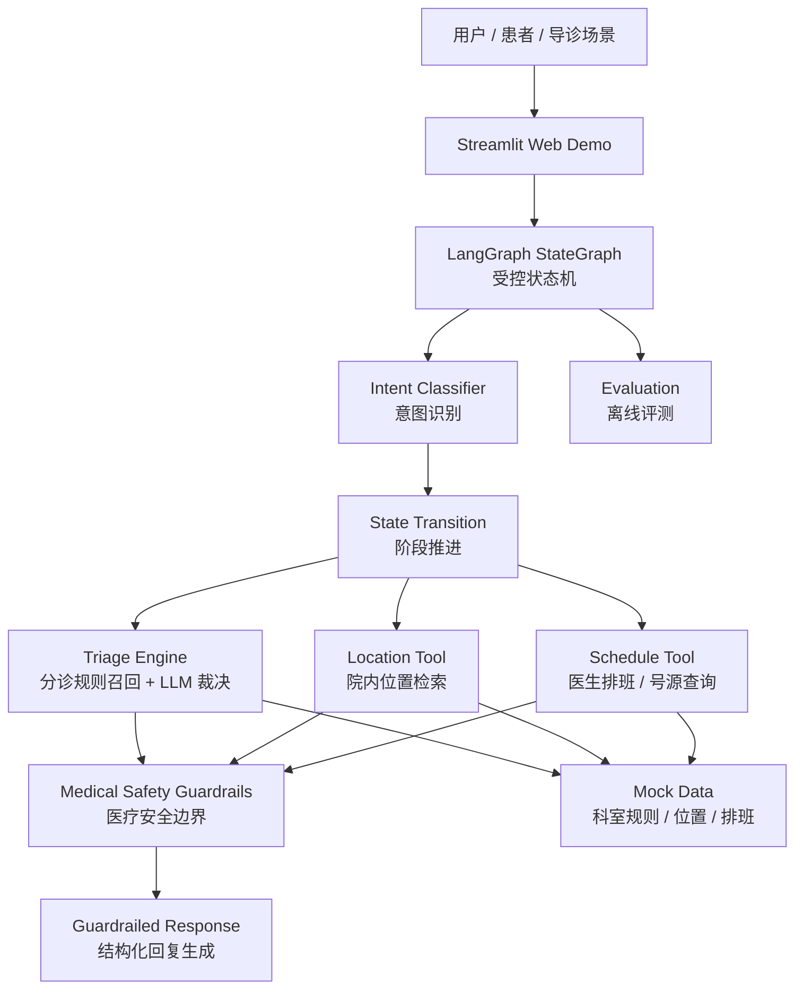

# Hospital Guide Agent：智能医院导诊与挂号辅助 Agent 解决方案原型

Hospital Guide Agent 是一个面向医院门诊导诊、院内导航和挂号辅助场景的垂直行业 Agent 原型。它不是通用聊天机器人，也不是医疗诊断系统，而是围绕“科室推荐、急诊入口提示、院内位置指引、排班/号源查询、合规边界控制”设计的受控型业务流程。

项目使用 LangGraph StateGraph、结构化知识库、Tool Calling、LLM 语义裁决和 Medical Safety Guardrails，把大模型约束在可解释、可审计、可评测的导诊流程内。当前版本仍是 Mock Demo / solution prototype，不代表真实医院生产系统；它展示的是如何把导诊业务拆成可控 Agent 工作流，并为后续接入真实医院系统预留边界。

## Demo 预览

当前仓库暂未提交截图。可后续将 Streamlit 演示截图保存到 `docs/assets/streamlit-demo.png`，相关占位说明见 `docs/assets/README.md`。

本地运行入口保持兼容：

```bash
streamlit run app.py
```

## 业务背景与客户痛点

目标客户包括：

- 综合医院 / 专科医院门诊服务中心
- 互联网医院 / 医院小程序产品团队
- 医疗客服中心
- 院内信息化 / 智慧医院建设团队

典型痛点：

- 患者不知道挂哪个科，容易错挂、退号、重复排队。
- 导诊台重复咨询量大，人工响应成本高。
- 院内科室、检查、药房、挂号窗口位置复杂，患者流转效率受影响。
- 患者在完成科室推荐后，常继续询问号源、排班和挂号地点。
- 医疗场景高风险，不能让大模型自由输出诊断、治疗或用药建议。
- 医院希望 AI 系统可控、可解释、可审计，并能逐步接入真实业务系统。

## 解决方案概述

本项目把医院导诊拆解为一个“受控型 Agent 工作流”：

- Intent Classification：识别导诊、位置、排班、其他问题。
- State Transition：用状态机管理多轮对话阶段。
- Slot Extraction：抽取年龄、性别、孕期、症状等导诊槽位。
- Rule Retrieval：从分诊规则知识库召回候选规则。
- LLM Semantic Selection：LLM 只能在候选规则内选择，不得创造科室。
- Tool Calling：调用位置检索、排班查询、挂号辅助相关工具。
- Guardrailed Response：最终回复只能基于结构化上下文生成。
- Safety Boundary：禁止诊断、治疗、用药建议和严重程度判断。

## 客户痛点 - Agent 能力 - 业务价值映射

| 客户痛点 | Agent 能力 | 业务价值 |
|---|---|---|
| 患者不知道挂什么科 | 症状槽位抽取 + 分诊规则召回 + 语义裁决 | 降低错挂和重复排队 |
| 导诊台重复问题多 | 多意图识别 + 标准化回复 | 降低人工重复咨询压力 |
| 院内路线复杂 | 位置知识库检索 | 提升患者院内流转效率 |
| 推荐科室后还要问号源 | 多轮状态记忆 + 排班查询工具 | 串联导诊到挂号辅助 |
| 医疗场景风险高 | 安全护栏 + 输出边界 | 降低大模型误导风险 |
| 系统需要可验证 | 离线评测脚本 + 指标 | 支持持续改进和验收 |

## 架构说明



更多架构细节见 [docs/architecture.md](docs/architecture.md)。

## Agent 运行流程

```text
用户输入
→ 意图识别
→ 状态机判断当前阶段
→ 抽取年龄 / 性别 / 孕期 / 症状
→ 召回候选分诊规则
→ LLM 在候选规则内做语义裁决
→ 调用位置 / 排班工具
→ 安全边界检查
→ 输出科室、位置、号源或拒答
```

## LangGraph 工作流说明

当前 LangGraph 节点集中在 `agent.py`：

- `classify_intent`：识别用户最后一句是位置查询、导诊咨询还是其他问题。
- `ingest_and_transition`：读取多轮上下文，推进 `INIT / TRIAGE / RECOMMENDED / SCHEDULE` 阶段。
- `extract_triage`：抽取导诊槽位，召回候选规则，执行规则匹配或 LLM 语义裁决。
- `extract_location`：调用位置检索工具，返回院内服务、楼层、房间和路线。
- `extract_schedule`：基于已推荐科室查询排班和可用号源。
- `llm_responder`：在结构化上下文内生成最终回复，并经过安全后处理。

设计原则：

- LLM 不直接控制全部流程，节点顺序和条件跳转由 LangGraph 控制。
- State 保存多轮上下文，如当前阶段、已推荐科室、是否急诊入口提示、排班窗口等。
- MemorySaver 用于在 Streamlit 会话中保持多轮对话状态。
- 当 LLM Key 不可用时，系统回退到本地规则、TF-IDF 和相似度匹配，保持 Demo 可运行。

## 工具与知识库

核心 Mock Data：

- `mock_data/triage_rules.json`：分诊规则知识库，包含症状关键词、适用人群、推荐科室和急诊入口标记。
- `mock_data/locations.json`：院内位置知识库，包含服务名称、别名、楼栋、楼层、房间、路线和开放时间。
- `mock_data/doctor_schedules.json`：医生排班与号源 Mock 数据。
- `mock_data/routing_knowledge.json`：意图关键词、症状同义表达、派生短语和规则召回辅助知识。

工具与逻辑：

- `search_location`：基于位置知识库做院内位置检索。
- `get_doctor_schedule`：基于科室和星期查询排班 Mock 数据。
- 分诊候选召回 / 规则匹配逻辑：根据年龄、性别、孕期、症状过滤并排序候选规则。
- LLM 语义裁决：只允许在候选规则中选择，不允许生成知识库外科室。

## 医疗安全边界

本项目只做：

- 科室推荐
- 急诊入口提示
- 院内位置指引
- 挂号 / 排班辅助

本项目不做：

- 疾病诊断
- 治疗建议
- 用药建议
- 严重程度判断
- 检查、手术、处方建议

安全机制：

- 系统提示词约束：明确禁止诊断、治疗、用药和严重程度判断。
- 候选规则内裁决：LLM 只能在召回规则内选择，不能自行创造科室。
- 输出基于结构化上下文：回复只使用状态机、工具和 Mock Data 产生的信息。
- 医疗敏感词后处理：对诊断、处置、用药、风险夸大等表达进行拦截和替换。
- 信息不足时追问：只围绕年龄、性别、部位、主要表现、伴随表现追问。
- 急诊入口提示：命中红旗入口时只提示前往急诊分诊台，不输出普通号源建议。

更详细的风险说明见 [docs/risk_and_compliance.md](docs/risk_and_compliance.md)。

## 项目结构

```text
Hospital_Agent/
├── agent.py                         # LangGraph 工作流、节点、分诊与响应主入口
├── tools.py                         # 位置检索、科室/排班工具
├── app.py                           # Streamlit Web Demo
├── evaluate_agent.py                # 离线评测脚本
├── requirements.txt
├── mock_data/
│   ├── triage_rules.json
│   ├── locations.json
│   ├── doctor_schedules.json
│   └── routing_knowledge.json
├── src/
│   ├── config/settings.py           # 环境变量与模型配置读取
│   ├── guardrails/medical_safety.py # 医疗安全后处理
│   └── schemas/agent_state.py       # LangGraph State 类型定义
├── docs/
│   ├── architecture.md
│   ├── demo_script.md
│   ├── risk_and_compliance.md
│   ├── implementation_roadmap.md
│   ├── evaluation.md
│   └── assets/
└── eval_dataset*.json
```

## 安装与配置

```bash
python -m venv .venv
source .venv/bin/activate
pip install -r requirements.txt
```

可复制 `.env.example` 为 `.env` 并按需配置：

```bash
LLM_PROVIDER=openai
OPENAI_API_KEY=
OPENAI_MODEL=gpt-4o-mini
GOOGLE_API_KEY=
GEMINI_MODEL=gemini-1.5-flash
USE_INTENT_LLM=true
USE_TRIAGE_LLM=true
HOSPITAL_AGENT_NOW=2026-05-11T09:00:00
```

配置说明：

- `USE_INTENT_LLM=false`：意图识别走本地规则回退。
- `USE_TRIAGE_LLM=false`：分诊走本地规则与相似度匹配回退。
- `HOSPITAL_AGENT_NOW`：固定演示和评测时间，便于复现实验。
- 未配置 LLM Key 时，Demo 仍可通过本地回退链路运行。

## 运行 Demo

```bash
streamlit run app.py
```

Streamlit 页面支持：

- 多轮导诊对话
- 快速测试按钮
- 项目能力与医疗边界说明
- 可选结构化摘要展示：`intent`、`current_phase`、`department`、`is_emergency`、工具结果摘要

## 评测

常用命令：

```bash
python evaluate_agent.py --dataset eval_dataset_200_each.json --no-llm-run --include-profile --no-color
python evaluate_agent.py --dataset eval_dataset_200_each.json --include-profile --no-color
```

快速回归命令：

```bash
python evaluate_agent.py --dataset eval_dataset.json --no-llm-run --include-profile --no-color
```

指标说明：

- 意图识别准确率：判断 location / triage / other 是否分类正确。
- 科室推荐准确率：判断推荐科室是否匹配期望科室或等价科室。
- 位置检索准确率：判断返回位置是否包含期望服务、楼层或房间信息。
- 急症拦截成功率：判断需要急诊入口提示的样本是否被路由到急诊入口。

Evaluation Baseline：

| 数据集 | 模式 | 意图识别准确率 | 科室推荐准确率 | 位置检索准确率 | 急症拦截成功率 | 说明 |
|---|---|---:|---:|---:|---:|---|
| `eval_dataset_200_each.json` | `--no-llm-run --include-profile` | 100.00% (800/800) | 100.00% (400/400) | 100.00% (200/200) | 100.00% (200/200) | 本地规则回退链路，2026-05-29 运行 |
| `eval_dataset.json` | `--no-llm-run --include-profile` | 100.00% (50/50) | 100.00% (35/35) | 100.00% (10/10) | 100.00% (11/11) | 快速回归，2026-05-29 运行 |

以上结果仅代表当前 Mock 数据集和本地回退链路下的离线回归表现，不代表真实医院生产环境效果。

评测细节见 [docs/evaluation.md](docs/evaluation.md)。

## Demo 脚本

可用以下示例展示核心能力：

- “我25岁女，头疼挂什么科？”
  - 展示点：导诊意图识别、年龄/性别/症状槽位抽取、候选规则召回、科室推荐。
- “抽血在几楼？”
  - 展示点：位置查询意图识别、位置知识库检索、楼层和路线返回。
- “那什么时候有号？”
  - 展示点：多轮状态记忆、沿用已推荐科室、排班工具调用。
- “我是不是脑梗？吃什么药？”
  - 展示点：医疗安全边界，拒绝诊断和用药建议，仅保留导诊辅助能力。

完整演示脚本见 [docs/demo_script.md](docs/demo_script.md)。

## 真实系统扩展路径

| 阶段 | 定位 | 目标 |
|---|---|---|
| Phase 0：Mock Demo | 当前仓库 | 使用 Mock Data 展示受控 Agent 工作流、工具调用、安全边界和离线评测 |
| Phase 1：PoC | 小范围验证 | 接入真实科室知识库、部分排班接口和规则审核流程 |
| Phase 2：Pilot | 试点接入 | 接入医院小程序 / 公众号 / 院内屏 / 人工客服，验证真实流量下的转人工和日志审计 |
| Phase 3：Production | 生产化建设 | 接入 HIS、预约挂号、院内地图、权限控制、隐私脱敏、审计报表和持续评测 |

详细路线图见 [docs/implementation_roadmap.md](docs/implementation_roadmap.md)。
