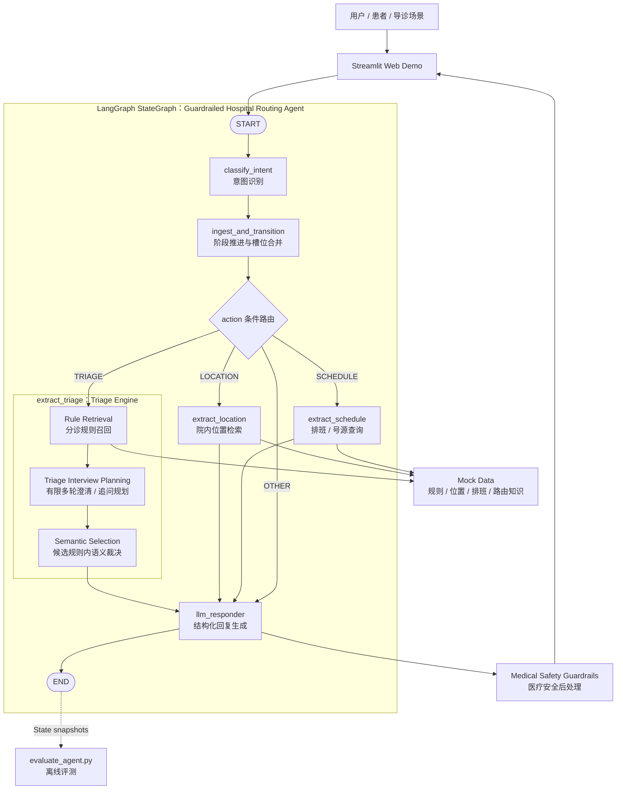

# 架构说明

## 系统目标

Hospital Guide Agent 的目标是把医院门诊导诊、院内位置指引和挂号辅助拆解为可控、可解释、可评测的 Guardrailed Hospital Routing Agent 工作流。系统不追求自由聊天能力，而是围绕结构化知识库、状态机、工具调用和安全护栏完成有限范围内的业务任务。

当前版本是 Mock Demo / solution prototype，核心目标包括：

- 展示导诊业务如何由 LangGraph StateGraph 管控。
- 展示 LLM 如何被限制在候选规则、结构化上下文和安全边界内。
- 展示系统如何通过有限多轮澄清收集导诊所需信息，并在候选规则和结构化知识库范围内推荐科室或急诊入口；该过程不用于诊断疾病。
- 支持无 LLM Key 时的本地规则回退，便于演示和评测。
- 为后续接入真实医院知识库、排班接口、院内地图和日志审计预留结构。

## 架构图

## LangGraph 节点说明

| 节点 | 作用 | 输入 | 输出 |
|---|---|---|---|
| `classify_intent` | 判断用户最后一句属于导诊、位置查询或其他问题 | `messages` | `intent`, `intent_source` |
| `ingest_and_transition` | 推进对话阶段，合并多轮槽位，判断下一步动作 | `intent`, `current_phase`, `messages` | `action`, `current_phase`, 槽位字段 |
| `extract_triage` | 抽取/校验导诊槽位，召回候选规则，完成科室推荐或追问 | 年龄、性别、孕期、症状 | `department`, `triage_advice`, `is_emergency`, `triage_candidate_rules` |
| `Triage Interview Planning` | `extract_triage` 内部模块，决定继续追问还是进入科室推荐 | 已有槽位、候选规则、多轮上下文 | `triage_followup_questions`, `triage_candidate_departments`, `triage_positive_findings`, `triage_negative_findings`, `triage_clarification_rounds` |
| `extract_location` | 查询院内位置知识库 | 用户问题 | `location_results` |
| `extract_schedule` | 查询医生排班和号源 Mock 数据 | 已推荐科室、目标星期 | `schedule_candidates`, `schedule_window` |
| `llm_responder` | 基于结构化上下文生成最终回复 | State 中的结构化字段 | AIMessage |

## State 字段说明

State 类型定义位于 `src/schemas/agent_state.py`。主要字段包括：

| 字段类别 | 字段 | 说明 |
|---|---|---|
| 消息 | `messages` | 多轮对话消息，由 LangGraph `add_messages` 合并 |
| 流程控制 | `current_phase` | 当前阶段：`INIT`、`TRIAGE`、`RECOMMENDED`、`SCHEDULE` |
| 流程控制 | `intent` / `action` | 用户意图和本轮动作 |
| 槽位 | `age`, `gender`, `pregnancy_status`, `symptom` | 导诊所需基础信息 |
| 分诊结果 | `department`, `triage_advice`, `is_emergency` | 推荐科室、入口提示和急诊入口标记 |
| 分诊证据 | `matched_symptoms`, `matched_rule_id`, `triage_candidate_rules` | 候选规则和匹配信息 |
| 追问状态 | `triage_followup_questions` | 信息不足时的有限追问，用于症状信息补齐 |
| 追问状态 | `triage_candidate_departments` | 候选科室收敛结果，不代表医学结论 |
| 追问状态 | `triage_positive_findings`, `triage_negative_findings` | 用户已表达或已否定的导诊相关表现，用于减少重复追问 |
| 追问状态 | `triage_interview_reason` | 追问规划的简短原因摘要，不作为对外医学解释 |
| 追问状态 | `triage_clarification_rounds` | deterministic clarification check 的有限追问轮次，用于避免重复追问 |
| 位置结果 | `location_results` | 位置工具返回的服务、楼栋、楼层、房间和路线 |
| 排班结果 | `schedule_day`, `schedule_candidates`, `schedule_window` | 排班工具返回的可用窗口 |
| 挂号辅助 | `registration_steps`, `registration_location` | 挂号步骤和挂号位置 |

## 工具调用说明

工具定义位于 `tools.py`：

- `search_location(query, k=3)`：读取 `mock_data/locations.json`，优先尝试向量检索，失败后使用 TF-IDF 和关键词相似度回退。
- `get_doctor_schedule(department, day_of_week)`：读取 `mock_data/doctor_schedules.json`，按科室和星期返回可用排班。
- `get_department(age, gender, symptom)`：保留的简单科室规则匹配接口，用于兼容和局部回退。

分诊召回逻辑仍位于 `agent.py`，主要包括：

- 症状文本归一化和同义表达替换。
- 年龄、性别、孕期过滤。
- 关键词匹配与 char n-gram TF-IDF 召回。
- 宽泛症状先进入 deterministic clarification check 或 `Triage Interview Planning`，信息足够后再进入候选内语义裁决。
- LLM 在候选规则内做语义裁决。
- `Triage Interview Planning`：当槽位不足、症状过于宽泛或候选科室仍然分散时，生成一个有限追问，用于补齐导诊信息、收敛候选科室和判断是否需要急诊入口；它不是完整临床问询流程，也不用于诊断疾病。

## 数据流说明

1. 用户输入进入 Streamlit，并附带当前 `thread_id`。
2. LangGraph 使用 MemorySaver 读取该线程的历史 State。
3. `classify_intent` 判断用户意图；LLM 不可用时走规则回退。
4. `ingest_and_transition` 根据历史阶段和用户表达决定动作。
5. 若为导诊，系统抽取槽位并召回候选规则；信息不足或宽泛症状先进入 deterministic clarification check / `Triage Interview Planning` 做有限多轮澄清；若为位置或排班，调用对应工具。
6. `llm_responder` 只接收结构化上下文，输出短句式导诊结果。
7. `src/guardrails/medical_safety.py` 对最终回复做敏感表达后处理。
8. 评测脚本可绕过最终回复生成，直接检查结构化 State 中的意图、科室、位置和急诊入口提示。

## 为什么这是受控型 Agent，而不是自由聊天机器人

- 有显式状态机：节点顺序和条件跳转由 LangGraph 控制，不由 LLM 自由决定。
- 有固定意图集合：只处理导诊、位置、排班和其他问题。
- 有结构化知识库：科室、位置、排班均来自 Mock Data。
- 有候选规则约束：LLM 只能从候选分诊规则中选择，不得创造科室。
- 有输出边界：最终回复只能基于结构化上下文，不允许自行补充医学结论。
- 有安全后处理：诊断、治疗、用药、判断严重程度等表达会被拦截。
- 有离线评测：可以用数据集回归验证意图、科室、位置和急诊入口提示效果。
