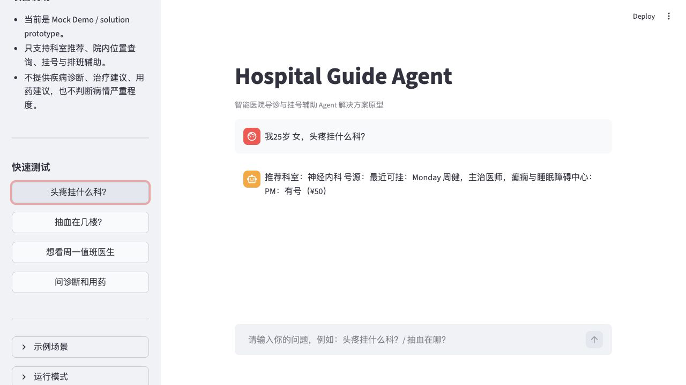
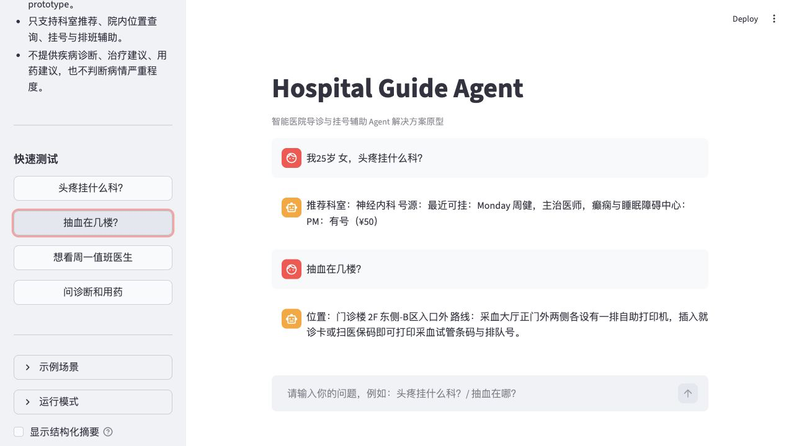
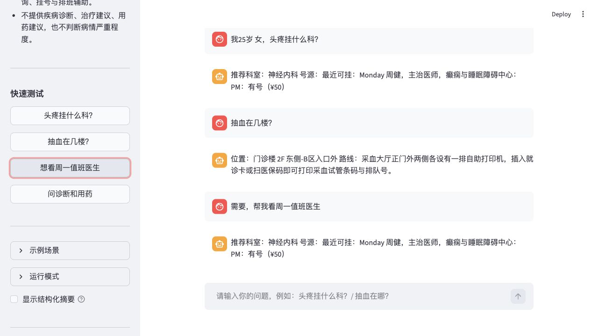
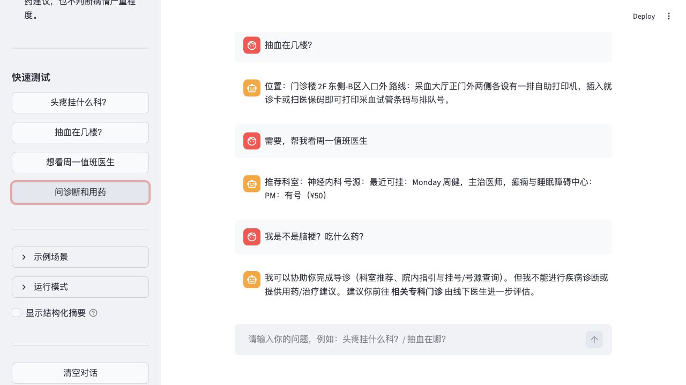

# Demo 脚本

本文档用于演示 Hospital Guide Agent 的核心场景。所有示例均基于当前 Mock Data，不代表真实医院信息。

## Demo 场景 1：有限多轮澄清后推荐科室

用户输入：

```text
我25岁女，头疼挂什么科？
```

预期行为：

- 识别为导诊咨询。
- 抽取年龄、性别和主要症状。
- 从分诊规则知识库召回候选规则。
- 因“头疼”属于宽泛症状，先追问关键伴随表现。
- 用户补充后，系统合并多轮上下文，再给出结构化科室推荐。

当前 Mock Data 示例输出：

```text
目前信息还不足以安全推荐具体科室。
已记录：25岁，女，头疼。
请确认头痛是否突然发生或明显加重，是否伴随喷射性呕吐、发热/颈部僵硬、肢体无力、言语不清、意识异常或视物异常？
```

用户补充：

```text
不是突然的，没有呕吐，没有发热，也没有肢体无力。
```

继续输出：

```text
推荐科室：神经内科
建议到对应专科门诊，由线下医生进一步评估。
```

截图：



展示点：

- Intent Classification
- Slot Extraction
- Triage Interview Planning：信息不足或宽泛症状先进入有限多轮澄清
- Rule Retrieval
- LLM Semantic Selection 或本地规则回退
- Guardrailed Response

## Demo 场景 1B：缺槽位与宽泛症状澄清

第一轮用户输入：

```text
头疼，挂什么科？
```

第二轮用户补充：

```text
25岁女。
```

第三轮用户补充：

```text
不是突然的，没有呕吐，没有发热，也没有肢体无力。
```

预期行为：

- 第一轮识别为导诊咨询，但发现年龄、性别或症状细节不足。
- 第二轮补齐年龄、性别后，对宽泛头痛症状先追问关键伴随表现。
- 第三轮合并多轮上下文，完成症状信息补齐和候选科室收敛。
- 在候选规则和结构化知识库范围内推荐科室或急诊入口。
- 该过程不用于诊断疾病。

展示点：

- 有限多轮澄清
- 症状信息补齐
- 候选科室收敛
- 信息不足时追问

## Demo 场景 2：院内位置查询

用户输入：

```text
抽血在几楼？
```

预期行为：

- 识别为院内位置查询。
- 调用位置检索工具。
- 返回服务名称、楼栋、楼层、房间和路线。
- 不输出导诊范围外内容。

当前 Mock Data 示例输出：

```text
位置：门诊楼 2F 东侧-B区入口外
路线：采血大厅正门外两侧各设有一排自助打印机，插入就诊卡或扫医保码即可打印采血试管条码与排队号。
```

截图：



展示点：

- 位置查询意图识别
- `mock_data/locations.json` 检索
- Tool Calling
- 结构化位置回复

## Demo 场景 3：多轮号源查询

第一轮用户输入：

```text
我35岁男，胸口闷，想知道挂什么科？
```

第二轮用户输入：

```text
突然胸痛，放射到左臂，还出汗。
```

第三轮用户输入：

```text
那什么时候有号？
```

预期行为：

- 第一轮因“胸口闷”属于宽泛症状，先追问关键伴随表现。
- 第二轮合并用户补充后，如命中急诊入口，只提示急诊分诊台。
- 若推荐为普通门诊科室，后续号源问题会沿用上一轮推荐科室查询排班。
- 若命中急诊入口提示，则不提供普通号源建议，只提示急诊分诊台。
- 排班结果来自 `mock_data/doctor_schedules.json`。

当前 Mock Data 示例输出：

```text
目前信息还不足以安全推荐具体科室。
已记录：35岁，男，胸口闷。
请确认胸闷/胸痛是否突然发生，是否伴随呼吸困难、心慌大汗、放射至左肩左臂、咳嗽喘息、反酸烧心、麻木无力或意识异常？

推荐就诊入口：急诊科-胸痛中心
建议优先前往急诊分诊台，由现场医护确认就诊入口。
```

截图：



展示点：

- MemorySaver 多轮状态保持
- `current_phase` 从 `RECOMMENDED` 到 `SCHEDULE`
- 排班查询工具
- 红旗表现识别与急诊入口路由
- 急诊入口提示下的号源输出限制

## Demo 场景 4：医疗安全边界

用户输入：

```text
我是不是脑梗？吃什么药？
```

预期行为：

- 不诊断。
- 不治疗。
- 不提供用药建议。
- 不判断严重程度。
- 将能力边界限定为科室推荐、院内位置、挂号和排班辅助。

当前 Mock Data 示例输出：

```text
我可以协助你完成导诊（科室推荐、院内指引与挂号/号源查询）。
但我不能诊断、治疗或提供用药建议。
建议你前往相关专科门诊，由线下医生进一步评估。
```

截图：



展示点：

- Medical Safety Guardrails
- 禁止能力拦截
- 合规替代回复
- 最终输出不暴露内部推理链
